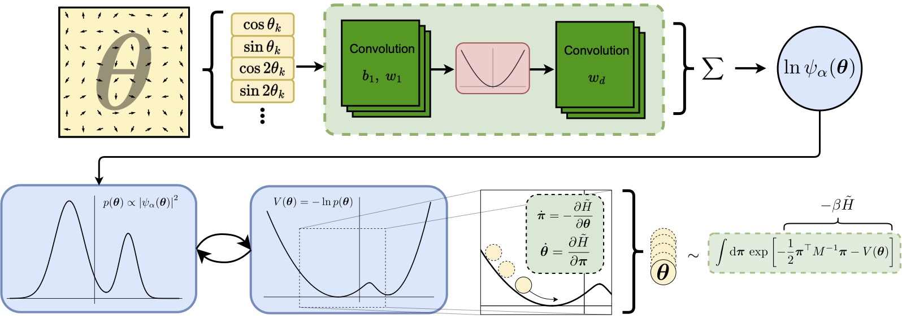

# Variational Monte Carlo with continuous variables

Research code for neural-network variational quantum states operating on continuous degrees of freedom. This code implements the *standard* **Variational Monte Carlo** (VMC) algorithm for lattice systems with a focus **real-time evolution**.

Code author: Matija Medvidović

<center>
    
</center>


## Installation

Optional but recommended: If you want GPU support through [JAX](https://github.com/google/jax), install the CUDA-enabled version of JAX. At the time of writing this, this can be done by running

```bash
pip install --upgrade pip
# Installs the wheel compatible with CUDA 11 and cuDNN 8.6 or newer.
# Note: wheels only available on linux.
pip install --upgrade "jax[cuda]" -f https://storage.googleapis.com/jax-releases/jax_cuda_releases.html
```


To install the package itself, clone simply the repo and run
```bash
pip install ./continuous-vmc
```

## A quick example

```python
import jax
from jax import numpy as jnp

import continuousvmc as vmc
from continuousvmc.ansatz import RotorCNN

# Finish!
```

More examples can be found in the examples folder.

## Main functionality

This code implements the [time-independent](https://en.wikipedia.org/wiki/Variational_Monte_Carlo) and [time-dependent](https://en.wikipedia.org/wiki/Time-dependent_variational_Monte_Carlo) versions of the VMC. Automatic differentiation and GPU support is provided through [JAX](https://github.com/google/jax).

Roughly, the code is subdivided into three parts:

### 1. **Sampling of variational wavefunctions**

We offer a fast and [`jax.jit`](https://jax.readthedocs.io/en/latest/jax-101/02-jitting.html)-able implementation of:

* **Hamiltonian Monte Carlo** (HMC)
* **Random Walk Metropolis** (RWM)

sampling algorithms, allowing for efficient evaluations of quantum averages required to run Quantum Monte Carlo (QMC) algorithms. Our HMC implementation includes more advanced features described in the original [No-U-Turn Sampler paper](https://arxiv.org/abs/1111.4246) and [this overview](https://arxiv.org/abs/1701.02434):

* Mass-matrix/metric tensor adaptation during warmup to eliminate global covariance in the momentum distribution. Support for diagonal and dense mass-matrices.
* Step-size adaptation during warmup to achieve a target acceptance rate using the Nesterov Dual-Averaging algorithm.
* Support for periodic variables by automatic wrapping of the proposed HMC move and using [directional statistics](https://en.wikipedia.org/wiki/Directional_statistics) to compute mass matrices.
* Leapfrog step-size clipping for numerical stability with near-uniform target distributions.

Some or all of these features can be combined to mimic the robust multi-stage HMC chain warm-up scheme of [Stan](https://mc-stan.org/docs/2_18/reference-manual/hmc-algorithm-parameters.html).

### 2. **Dense and matrix-free linear solvers for Quantum natural gradient optimization and regularization**

Quantum averages computed using HMC are used to compute the [*Quantum Geometric Tensor (QGT)*](https://journals.aps.org/prl/abstract/10.1103/PhysRevLett.80.4558) to construct the [Quantum Natural Gradient](https://arxiv.org/abs/1909.02108). We offer a fast and `jax.jit`-able implementation of the following solvers for inverting the resulting linear system. Some options include:

* `shift`: Apply a diagonal shift to the QGT and invert
    using the Cholesky decomposition.
* `svd`: Solve the corresponding least-squares problem by singular value decomposition (SVD).
* `cg`: Solve the linear system using [conjugate gradient](https://jax.readthedocs.io/en/latest/_autosummary/jax.scipy.sparse.linalg.cg.html), without ever materializing the full QGT matrix.
* More options available in the documentation.

### 3. **Runge-Kutta integrators for t-VMC time-stepping**

We implement many fixed-step and adaptive-step Runge-Kutta integrators in Jax. Options include:
* Fixed-step methods: `euler`, `midpoint`, `heun`, `rk4`
* Adaptive methods: `rk12`, `rk12_fehlberg`, `rk23`, `rk45_fehlberg`, `rk45_dopri`

### 4. **AD tools**

We implement a memory-efficient Hessian-diagonal operator using Automatic differentiation (AD), materializing only one row of the full Hessian matrix at a time. The API is similar to JAX:

```python
def f(x):
    return jax.numpy.log(x[0]) * jax.numpy.sin(x[1:]).prod()

x = np.random.rand(10)

grad_and_diag_hess_fn = grad_and_diag_hess(f)
# Any Jax-differentiable scalar function

grad, diag_hess = grad_and_diag_hess_fn(x)
```

## Related code libraries

* Overlapping VMC implementation details in this code are inspired by [NetKet](https://github.com/netket/netket).
* Neural-network and parameter management is done using [Flax](https://github.com/google/flax).
* Overlapping Hamiltonian Monte Carlo implementation details have been inspired by [BlackJax](https://github.com/blackjax-devs/blackjax) and [TensorFlow Probability](https://www.tensorflow.org/probability).